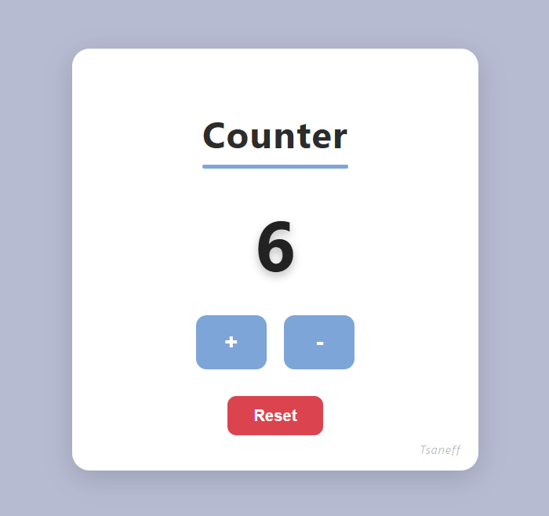

# 🧮 Counter App

A simple, responsive counter app built with **HTML**, **CSS**, and **JavaScript**. Designed with a clean interface and smooth user experience.

---

## 🎯 Features

- Increment and decrement the counter
- Reset button to return to 0
- Subtle animations for better feedback
- Responsive design for desktop and mobile
- Signature watermark ("Tsaneff") in bottom corner

---

## 🖼️ Preview

---

## 🚀 Live Demo

You can test the app directly through **GitHub Pages**:

👉 [https://ktsaneff.github.io/counter-application/](https://ktsaneff.github.io/counter-application/)

---

## 🛠️ Technologies Used

- HTML5
- CSS3 (flexbox, transitions, shadows)
- Vanilla JavaScript (DOM manipulation)

---

## 👤 Author

**Tsaneff**

> Feel free to clone and customize this project for your own use.
